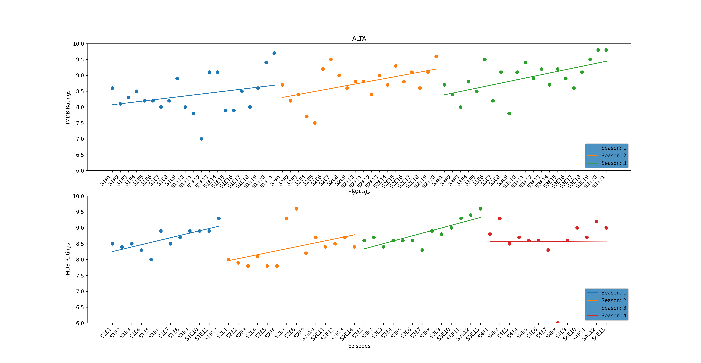

# imdb_series_data_sience
this creates a nice plot out of imdb ratings

just import the function and use it as following:
```python
import matplotlib.pyplot as plt

from imdb import scrape_imdb

fig, axes = plt.subplots(2, 1)

scrape_imdb(axes[0], "tt0417299", 3, "ALTA", (6,10))
scrape_imdb(axes[1], "tt1695360", 4, "Korra", (6,10))

plt.show()

fig.savefig("Avatar_and_Korra.png", dpi=300)
```


